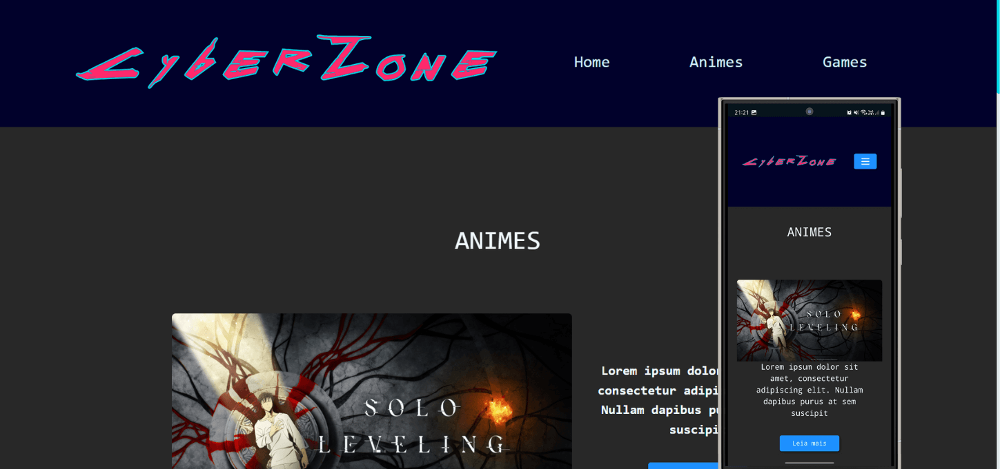

## Projeto HTML, CSS, JS Multiverso-News

Como estudante da Guilda de Desenvolvedores Geek, fui convocado para criar um portal de notícias geek. Este espaço será um refúgio para os aventureiros da cultura nerd, com informações sobre o multiverso. Usarei HTML, CSS, SEO e acessibilidade para garantir um site funcional e inesquecível. Vamos à jornada!

## Screenshots

  

## Link do projeto publicado

https://4lisson0.github.io/cyberzone/

## 🚀 Tecnologias

Esse projeto foi desenvolvido com as seguintes tecnologias:

- HTML, CSS, SEO e Bootstrap 5
- Git e Github
- Figma

## 🔖 Layout

Você pode visualizar o layout do projeto através [DESSE LINK](https://www.figma.com/design/Tvaqk1qFZviTJF7qqLXepM/CyberZone?m=auto&t=aqLf0spbl6nppp7n-6). É necessário ter conta no [Figma](https://figma.com) para acessá-lo.

## :memo: Licença

Esse projeto está sob a licença MIT.
